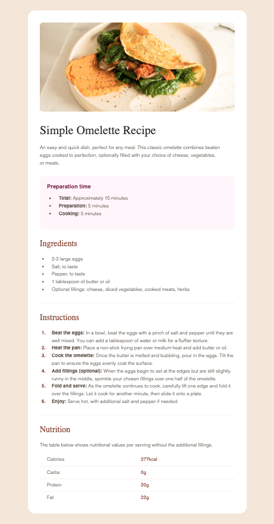

# Frontend Mentor - Social Links Profile

This is a solution to the [Social links profile challenge on Frontend Mentor](https://www.frontendmentor.io/challenges/social-links-profile-UG32l9m6dQ). Frontend Mentor challenges help you improve your coding skills by building realistic projects.

## Table of contents

- [Overview](#overview)
  - [Screenshot](#screenshot)
  - [Links](#links)
- [My process](#my-process)
  - [Built with](#built-with)
  - [What I learned](#what-i-learned)
  - [Continued development](#continued-development)
  - [Useful resources](#useful-resources)
- [Author](#author)
- [Acknowledgments](#acknowledgments)

## Overview

### Screenshot



### Links

- Solution Github Repo URL: [Solution repo](https://github.com/cepoumian/recipe-page)
- Live Site URL: [Solution live](https://cepo-recipe-page.netlify.app/)

## My process

### Built with

- Semantic HTML5 markup
- Flexbox
- CSS custom properties
- CSS Layers

### What I learned

In this VERY simple project I wanted to focus on what I've learned from the [Every Layout](https://every-layout.dev/) CSS methodology.

The Every Layout book proposes an approach to layout based on classes or web components that tackle one specific task at a time. It also makes special emphasis on utilizing css logical properties (inline, block, etc.) instead of properties that would only work in horizontal-tb writing modes (e.g., margin-block-start instead of margin-top).

For example, the Stack has the single task of adding top margin:

```css
.stack {
  display: flex;
  flex-direction: column;
  justify-content: flex-start;
}

.stack > * {
  margin-block: 0;
}

.stack > * + * {
  margin-block-start: var(--spacing-sm);
}
```

The Cover has the task of centering its content vertically and horizontally:

```css
.cover {
  display: flex;
  flex-direction: column;
  min-block-size: 100vh;
  justify-content: center;
  align-items: center;
  padding: 1rem;
}
```

Every Layout also propses an approach to creating, using and naming utility classes that makes a lot of sese:

```html
<div class="cover bg:light">
  <div class="box container stack bg:white pb:lg">
    <figure class="figure mb:xs">
      
    </figure>
    <div class="wrapper stack">
      <h3 class="heading text:center">
        Improve your front-end skills by building projects
      </h3>
      <p class="text text:center">
        Scan the QR code to visit Frontend Mentor and take your coding skills to
        the next level
      </p>
    </div>
  </div>
</div>
```

On the other hand, I also wanted to leverage CSS layers as a way of organizing styles and managing specificity, as suggested by Kevin Powell in his (Frontend Master's course)[https://frontendmasters.com/courses/pro-css/].

```css
@layer utilities {
  .text\:center {
    text-align: center;
  }

  .bg\:light {
    background-color: var(--background-light);
  }
}
```

### Useful resources

- [Every Layout](https://www.example.com) - This is, by far, one of the most valuable resources on CSS and web layout I've found. Highly recomended.

- [Kevin Powell's Frontend Master's course](https://frontendmasters.com/courses/pro-css/) - One of CSS's greatest educators.

## Author

- Website - [Cesar Poumian](https://github.com/cepoumian)
- Frontend Mentor - [@cepoumian](https://www.frontendmentor.io/profile/cepoumian)
